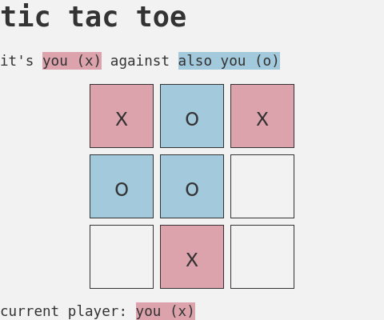

A Tic Tac Toe game for the [Odin Project](https://www.theodinproject.com/lessons/node-path-javascript-tic-tac-toe).

The goal was to use factory functions and the module pattern.

# TODO

- [ ] functionality to change players' names

- [ ] reset button

